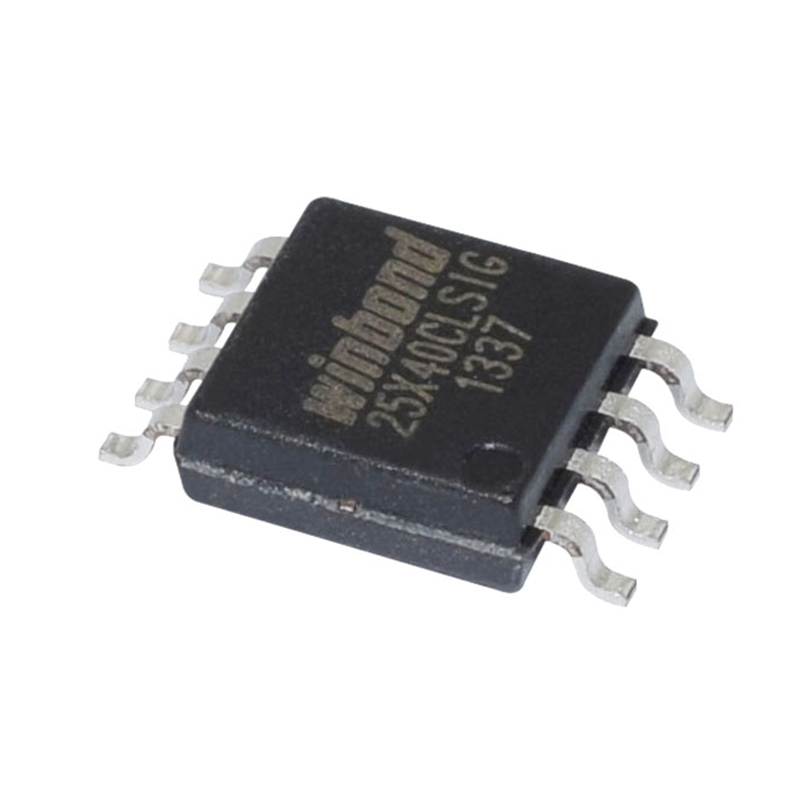

<center>


Created by Ouroboros Embedded Education.
</center>

## Versions Changelog

V1.0.0

- Initial Release

# NOR Flash Driver – C Library Documentation

<center></center>

This documentation describes the implementation and usage of the NOR Flash driver as defined in [`nor.c`]. The driver provides a hardware-agnostic, extensible interface for controlling SPI NOR Flash memory devices, supporting initialization, power management, erase, read/write, and memory region checks.

---

## Features

- **Hardware-independent:** User supplies SPI, GPIO, and delay functions.
- **Device autodetection:** Reads JEDEC and unique IDs to identify and configure the NOR device.
- **Power management:** Supports deep power-down and wake-up.
- **Erase operations:** Chip, block, sector, and address-based erase.
- **Read/write operations:** Byte-wise and buffer-based access.
- **Memory region utilities:** Check if address, page, sector, or block is empty.
- **Debugging:** Optional debug output via `NOR_DEBUG`.

---

## Initialization \& Configuration

### Initialization

```c
nor_err_e NOR_Init(nor_t *nor);
nor_err_e NOR_Init_wo_ID(nor_t *nor);
```

- **`NOR_Init`**: Detects and configures the NOR device using JEDEC ID. Fails if device is unknown.
- **`NOR_Init_wo_ID`**: Initializes with user-supplied parameters, skipping JEDEC/model checks.


#### Required User Configuration

Before calling `NOR_Init`, fill the `nor_t` struct with:

- SPI transmit/receive function pointers (`SpiTxFxn`, `SpiRxFxn`)
- GPIO chip-select assert/deassert functions (`CsAssert`, `CsDeassert`)
- Microsecond delay function (`DelayUs`)
- (Optional) Mutex lock/unlock functions for thread safety

---

## Power Management

```c
nor_err_e NOR_EnterPowerDown(nor_t *nor);
nor_err_e NOR_ExitPowerDown(nor_t *nor);
```

- **EnterPowerDown**: Puts the NOR device into deep power-down mode.
- **ExitPowerDown**: Wakes the device from deep power-down.

---

## Erase Operations

```c
nor_err_e NOR_EraseChip(nor_t *nor);
nor_err_e NOR_EraseAddress(nor_t *nor, uint32_t address, nor_erase_method_e method);
nor_err_e NOR_EraseSector(nor_t *nor, uint32_t sectorAddr);
nor_err_e NOR_EraseBlock(nor_t *nor, uint32_t blockAddr);
```

- **EraseChip**: Mass erase of the entire chip.
- **EraseAddress**: Erase at a specific address with method (4K, 32K, 64K).
- **EraseSector/Block**: Erase sector/block by index.

---

## Read/Write Operations

```c
nor_err_e NOR_WriteBytes(nor_t *nor, uint8_t *buffer, uint32_t address, uint32_t length);
nor_err_e NOR_ReadBytes(nor_t *nor, uint8_t *buffer, uint32_t address, uint32_t length);
```

- **WriteBytes**: Writes a buffer to the specified address.
- **ReadBytes**: Reads data from the specified address into a buffer.

---

## Memory Region Utilities

Check if a region is empty (all bytes erased):

```c
nor_err_e NOR_IsEmptyAddress(nor_t *nor, uint32_t address, uint32_t length);
nor_err_e NOR_IsEmptyPage(nor_t *nor, uint32_t pageAddr, uint32_t offset, uint32_t length);
nor_err_e NOR_IsEmptySector(nor_t *nor, uint32_t sectorAddr, uint32_t offset, uint32_t length);
nor_err_e NOR_IsEmptyBlock(nor_t *nor, uint32_t blockAddr, uint32_t offset, uint32_t length);
```

Returns `NOR_OK` if empty, `NOR_REGIONS_IS_NOT_EMPTY` if not.

---

## Address Conversion Utilities

Convert between logical page, sector, and block addresses:

```c
uint32_t NOR_PageToSector(nor_t *nor, uint32_t pageAddr);
uint32_t NOR_PageToBlock(nor_t *nor, uint32_t pageAddr);
uint32_t NOR_SectorToBlock(nor_t *nor, uint32_t sectorAddr);
uint32_t NOR_SectorToPage(nor_t *nor, uint32_t sectorAddr);
uint32_t NOR_BlockToPage(nor_t *nor, uint32_t blockAddr);
```


---

## Internal/Private Functions

- **JEDEC/Unique ID reading:** `_nor_ReadID`, `_nor_ReadUniqID`
- **Status register access:** `_nor_ReadStatusRegister`, `_nor_WriteStatusRegister`
- **Write enable/disable:** `_nor_WriteEnable`, `_nor_WriteDisable`
- **Busy wait:** `_nor_WaitForBusy`
- **Mutex lock/unlock for thread safety**

---

## Error Handling

Most functions return `nor_err_e` codes, such as:

- `NOR_OK`
- `NOR_FAIL`
- `NOR_INVALID_PARAMS`
- `NOR_NOT_INITIALIZED`
- `NOR_NO_MEMORY_FOUND`
- `NOR_UNKNOWN_DEVICE`
- `NOR_REGIONS_IS_NOT_EMPTY`

---

## Debugging

Define `NOR_DEBUG` to enable debug output via `printf`.
Buffer length for empty checks can be set with `NOR_EMPTY_CHECK_BUFFER_LEN` (default: 64).

---

## Example Usage

```c
nor_t nor = {
    .config = {
        .SpiTxFxn = my_spi_tx,
        .SpiRxFxn = my_spi_rx,
        .CsAssert = my_cs_assert,
        .CsDeassert = my_cs_deassert,
        .DelayUs = my_delay_us,
        // Optionally MutexLockFxn, MutexUnlockFxn
    }
};

if (NOR_Init(&amp;nor) == NOR_OK) {
    // Ready to use NOR flash
    uint8_t data[^256];
    NOR_ReadBytes(&amp;nor, data, 0x0000, sizeof(data));
}
```


---

## Notes

- Always check return values for error handling.
- Use mutexes in multi-threaded environments.
- For unknown devices, use `NOR_Init_wo_ID` with manual configuration.

---

**For further details, refer to the code and comments in `nor.c`.**